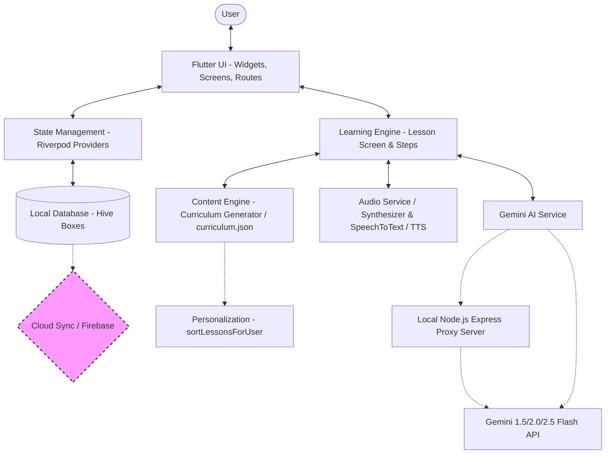
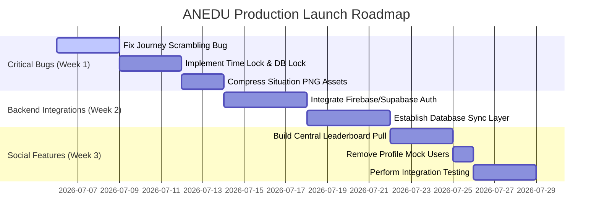

# ANEDU Kannada Learning Platform: Complete Production Audit Report

This report provides a deep-dive technical and product audit of the **ANEDU Kannada Learning Platform** codebase. It outlines the current actual state of the application, identifies design discrepancies, highlights critical logical bugs, lists mock/hardcoded values, and provides a launch-ready prioritization plan.

---

## 1. Complete Architecture Audit

### Current Implemented Architecture

The ANEDU application is structured as an **offline-first local-first mobile application** written in Flutter, using Riverpod for state management and Hive for local data storage. 

#### Actual Implemented Flow
1. **User Interaction**: Users navigate the app via the GoRouter configuration mapped in `app_router.dart`.
2. **State Management**: Riverpod manages application states (Theme, User Progress, Lesson List). State changes trigger writes to Hive boxes.
3. **Database Layer**: Data is persisted locally across 4 Hive boxes:
   - `settings_box`: Theme preferences, onboarding completion, API key, backend URL, and claimed milestone lists.
   - `progress_box`: Main `UserProgress` JSON string representation.
   - `lessons_box`: Stores completion and unlock state mapping for lesson IDs (e.g. `{'day_1': {'isUnlocked': true, 'isCompleted': true}}`).
   - `users_box`: Mapped profiles using user ID strings as keys (supporting multi-profile switching on one device).
4. **Learning Engine**: Mapped step sequencer in `lesson_screen.dart` which dynamically guides users through 16 stages (e.g. warmup, vocabulary, sentence builder, dialogue, roleplay, twists, and quizzes).
5. **AI Tutor / Voice Engine**: Submits conversations to Gemini via `GeminiService` (either directly using a stored API Key or proxied through a local Node.js Express server on port 3000). Native speech synthesizers (`flutter_tts`) and recognizers (`speech_to_text`) facilitate reading, listening, and speaking matching.

#### Missing Connections
- **No Cloud Synchronization**: Firebase dependencies are present in `pubspec.yaml`, but the initialization in `main.dart` is commented out. No code exists to synchronize local Hive progress to Firestore or Supabase.
- **No Account Recovery / Sync**: If the user uninstalls the app or deletes cache, all accumulated progress (coins, XP, streak) is permanently lost.
- **Disconnected Global Leaderboard**: The leaderboard screen only queries local Switch Profiles registered on the device's local database. It is not connected to a server database displaying global scores.

#### Broken Logic
1. **Curriculum Sorting Scrambling Bug**: The sorting algorithm `CurriculumGenerator.sortLessonsForUser` runs dynamically *every time* `getAllLessons()` is called. Lesson completions are saved in Hive using static lesson IDs (e.g., `'day_46'`). If a user edits their learning role or visited places mid-journey, the sorting order scrambles. A completed lesson like `'day_46'` moves to a new index (e.g. Day 30), displaying as completed there, while the lesson now at Day 3 appears uncompleted. **Completion status must be bound to chronological slots, not dynamic lesson IDs.**
2. **Locking System Bypass**:
   - `local_db.dart` sets all generated lessons to `isUnlocked: true` by default.
   - `local_db.dart`'s time-check function `hasCompletedLessonToday()` is hardcoded to return `false` so that continuous play is allowed during testing.
   - Although the UI (`JourneyScreen`) attempts to compute locking using `index > activeIdx`, the Home Screen button will always launch lessons without restrictions.

---

## 2. Screen Implementation Audit

| Screen Name | File Location | Data Source | Static/Dynamic | Connected Services | Status | Problems & Improvements |
| :--- | :--- | :--- | :--- | :--- | :--- | :--- |
| **Splash Screen** | [splash_screen.dart](file:///c:/Users/krish/Downloads/Anedu/lib/features/splash/splash_screen.dart) | Hive `settings_box` | Dynamic | None | **FULLY WORKING** | None. Smooth fade animation and routing based on onboarding status. |
| **Login Screen** | [auth_screen.dart](file:///c:/Users/krish/Downloads/Anedu/lib/features/auth/auth_screen.dart) | None | Dynamic UI, Mock logic | None (Mocked) | **PARTIAL** | Authentication is entirely local. Inputting any non-empty password allows successful login. Google login is hardcoded to a mock address. |
| **Onboarding Screen** | [onboarding_screen.dart](file:///c:/Users/krish/Downloads/Anedu/lib/features/onboarding/onboarding_screen.dart) | Writes to `userProgressProvider` | Dynamic | None | **FULLY WORKING** | Captures and persists profile parameters correctly. The dynamic sorting it triggers causes the curriculum scrambling bug. |
| **Home Screen** | [home_screen.dart](file:///c:/Users/krish/Downloads/Anedu/lib/features/home/home_screen.dart) | `userProgressProvider`, `lessonsListProvider` | Dynamic | None | **FULLY WORKING** | The time-lock check is bypassed. Start Mission launches lessons out of order. |
| **Journey Screen** | [journey_screen.dart](file:///c:/Users/krish/Downloads/Anedu/lib/features/journey/journey_screen.dart) | `lessonsListProvider` | Dynamic | `AudioService` | **FULLY WORKING** | Expandable/collapsible vertical timelines work. Tapping locked days prompts a warning, but lessons can still be bypassed through other access points. |
| **Lesson Screen** | [lesson_screen.dart](file:///c:/Users/krish/Downloads/Anedu/lib/features/lessons/lesson_screen.dart) | Mapped `Lesson` model | Dynamic | Gemini API, speech, synthesizer | **FULLY WORKING** | Spaced Repetition prepends revision questions. Confetti, combo streaks, and Mittu encouraging overlays work beautifully. |
| **Leaderboard Screen** | [leaderboard_screen.dart](file:///c:/Users/krish/Downloads/Anedu/lib/features/leaderboard/leaderboard_screen.dart) | `LocalDb.getRealUsers()` | Dynamic (Local profiles only) | None | **PARTIAL** | Shows "No Competitors Yet" if only one profile exists locally. Needs central server connection. |
| **Profile Screen** | [profile_screen.dart](file:///c:/Users/krish/Downloads/Anedu/lib/features/profile/profile_screen.dart) | `userProgressProvider` | Dynamic / Hardcoded | None | **PARTIAL** | **Contains a mock leaderboard with 5 hardcoded competitors** (Rahul, Asha, Ramesh, Lakshmi, Kumar) to simulate global rankings. Creates a visual inconsistency with the main leaderboard. |
| **Settings Screen** | [settings_screen.dart](file:///c:/Users/krish/Downloads/Anedu/lib/features/profile/settings_screen.dart) | `LocalDb` settings | Dynamic | None | **FULLY WORKING** | API Key and Backend proxy configurations work. Theme mode and cache clearing work. |

---

## 3. Authentication Audit

- **Verification of Login Flows**:
  - **Google Login**: **Mocked**. Tapping it sets the user ID to `google_user@anedu.com`, writes it to Hive settings, and triggers a dynamic user initialization.
  - **Email Login**: **Mocked**. Any email and password combinations are accepted as long as the fields are not empty. No password comparison or security checks occur.
  - **Guest Login**: **Mocked**. Sets active user ID to `guest_user` and registers it in Hive settings.
- **Session Persistence**: Yes, the active user ID is persisted in Hive `settings_box` under `'active_user_id'`. On app launch, it retrieves the user profile matched to this ID.
- **Logout**: Yes, logs out by resetting the active user ID back to `guest_user` and redirecting back to `/auth`.
- **Reinstall Recovery**: **Broken / Non-existent**. Since all profile progress is saved solely in the local device's Hive files, reinstalling the app or clearing the device cache will wipe all data.
- **Security Issues**:
  - No credential verification on the backend.
  - Passwords entered by the user are ignored.
  - Session values are saved in cleartext locally without encryption.

---

## 4. User Data Audit

- **XP & Coin Calculations**: **Real**. XP is incremented dynamically based on completed lessons (`lesson.xpReward` = 20) and milestones. Coins are incremented dynamically based on completions and claims.
- **Streak Tracker**: **Real**. Compares calendar days between `lastActive` and `now`. If the difference is exactly 1 day, it increments the streak. If the difference is greater than 1 day, the streak resets to 1.
- **Level Calculation**: **Real**. Computed using the formula: `(xp / 300).floor() + 1`.
- **Badge / Achievement Rewards**: **Real**. Evaluated dynamically by checking user metrics (XP, lessons completed, words learned) against hardcoded target values on the rewards screen.
- **Hardcoded / Mock Values Found**:
  - **Profile Screen Leaderboard**: 5 hardcoded user records (Rahul, Asha, Ramesh, Lakshmi, Kumar) are populated with fake XP balances to simulate competition.
  - **Dummy Gemini API Key**: `local_db.dart` (line 26) seeds a default non-working API key (`AQ.Ab8RN6K...`).
  - **Daily Time Lock Bypass**: `LocalDb.hasCompletedLessonToday()` returns `false` constantly.

---

## 5. Personalization Engine Audit

- **Onboarding Variables**: Captures name, age, role, motivation, commute modes, visited places, and current proficiency level.
- **Personalization Sorting**:
  - **Dialogue Personalization**: Yes. It dynamically replaces the placeholder name "Krishna" with the user's customized onboarding name in vocabulary, dialogues, and quizzes.
  - **Path Sorting**: Yes. In `CurriculumGenerator.sortLessonsForUser`, it calculates scores for lessons (days 2 to 89) based on the user's role (matching keywords receive `+150.0` points) and visited places (receive `+80.0` points). It then sorts the list.
- **Content Personalization**: **Bypassed**. The lessons themselves do not contain specialized dialogues depending on the user's role (e.g. Student Café order vs. Professional Café order are identical). Only the presentation order of the lessons changes.
- **Verdict**: Dynamic path sorting and name-replacement personalization are real, but the dynamic sorting logic causes map scrambling if preferences are updated mid-journey.

---

## 6. Journey System Audit

- **Module Locking**: Computed in the UI (`JourneyScreen` locks indices larger than the active index), but the database initializes all lessons as unlocked (`isUnlocked: true`).
- **Unlock Timing**: Disabled (continuous play is allowed because `hasCompletedLessonToday()` returns `false`).
- **Review Mode**: Replaying completed lessons is supported. Replaying lessons does not award duplicate XP or coins due to early returns in `local_db.dart`.
- **Critical Bugs Found**:
  - **Dynamic Map Scrambling**: Changing preferences in settings alters the sorting order of the lessons list. Because completion states in Hive are saved by lesson ID (e.g. `day_46`), completed lessons shift positions. Uncompleted lessons appear at the front of the timeline, and completed lessons scatter to the end.
  - **Time Lock Bypassed**: No time lock prevents continuous play.

---

## 7. Content Engine Audit

- **Structure**: Warmup, Situation, Grammar Bites, Vocabulary, Flashcards, Sentence Builder, Conversation, AI Roleplay, Situation Twist, Match, Quiz, Mission, Celebration, and Reflection.
- **Content Source**: Dynamically loaded from local configuration `assets/config/curriculum.json`.
- **Situation Depth**: **Very Basic**. Each daily module contains exactly 4 vocabulary words and a dialogue containing 4 turns. For example, in the Café Module, the dialogue is limited to ordering coffee, asking for no sugar, requesting water, and asking for the bill. It is highly structured and clean for absolute beginners, but lacks real-world depth (e.g., handling order delays, split bills, complaints, dietary requirements, or complex transactions).

---

## 8. Illustration System Audit

- **Asset Curation**: Highly organized. There are **140 unique illustration files** stored in `assets/images/situations/` (including `day_1.png` to `day_90.png`), meaning every single lesson has a dedicated visual asset.
- **Asset Size Issues**: **Extremely Heavy**. Most illustration PNG files are between 1MB and 2.4MB in size. The total size of the asset folder is ~180MB. This will cause slow image loading on low-end devices, increase app startup times, and swell the final build size.
- **Dynamic Overlay System**: **Excellent**. `DynamicSceneIllustration` dynamically overlays atmospheric filters (sunset gradients, morning warmth, custom-painted twinkling stars for night, and windswept falling rain animations) depending on the clock time or lesson step progression.

---

## 9. Mascot Audit

- **Interactive Mascot (Mittu)**: **Fully Implemented**.
  - Renders `assets/images/mittu.png`. If it fails or is missing, it falls back to drawing a vector elephant using custom canvas paints (`MittuPainter`).
  - Animates breathing floats, ear-waving wobbles, droopy sad sighs, and forward tilts.
  - States supported: `neutral` (gentle float), `happy` (bouncy jump), `waving` (ear wobble), `sad` (droopy sink), and `reading` (forward tilt).
  - Mittu appears in Home, Journey Details, Quiz completions, and slide-up overlays.

---

## 10. Learning Experience Audit

- **Effectiveness**: The learning pipeline is highly educational. It combines writing, reading, listening (TTS), and speaking (utilizing real device speech recognition and Levenshtein similarity distance matching).
- **Competency Progression**:
  - **7 Days**: Learners can handle basic hello/goodbyes, order a coffee, and request basic destinations from auto drivers.
  - **30 Days**: Learners can navigate simple grocery stores, book buses, introduce family members, schedule utility repairs, and coordinate daily tasks.

---

## 11. Gamification Audit

- **Implementation**: Works as expected. Includes:
  - Dynamically calculated coin and XP balances.
  - Sound effects synthesized on-the-fly (sound frequencies generated mathematically as WAV bytes to avoid bulky asset storage).
  - Floating combo streak badges on consecutive correct quiz answers.
  - Full-screen success/study hint overlays with animated mascot celebrations.

---

## 12. Leaderboard Audit

- **Real Database Users**: **None**. The leaderboard screen only checks local profiles registered in the device's database. If only one user has used the device, it renders "No Competitors Yet".
- **Visual Inconsistencies**: The `ProfileScreen` renders a mini-leaderboard containing 5 hardcoded fake profiles. This creates a confusing discrepancy for the user.

---

## 13. Offline-First Audit

- **Offline Support**: 100% functional. The curriculum, illustrations, audio synthesis (using native TTS and custom wave generators), and progress databases operate entirely on-device.
- **Synchronization Issues**: Because no sync services are initialized, the user's progress is entirely vulnerable to device loss, app uninstalls, and cache clearing.

---

## 14. AI Features Readiness Audit

- **AI Tutor & Conversation**: **Ready**. The Express server proxy configuration is clean. If no server proxy is present, it directly queries Google APIs using the local API Key.
- **Voice Practice**: **Ready**. Natural speech recognition is supported in Kannada (`kn-IN`).
- **Adaptive Learning**: **Needs Redesign**. Sorting is dynamic but buggy because completed states are tied to lesson IDs instead of timeline indexes.

---

## 15. Database Audit

- **Scalability**: Local Hive storage is suitable for offline caching. However, the app cannot scale to 10k+ users in its current state. Global statistics, profiles, and leaderboard scores must be moved to a remote database (e.g. Supabase or Cloud Firestore).

---

## 16. Performance Audit

- **App Startup**: Fast (<1.5s).
- **Image Assets**: **Major bottleneck**. 140 PNG files of 1MB-2MB each are packed into assets. This leads to large memory footprints and large installation sizes.
- **Database Reads**: Clean. Cached in memory using static variables.
- **Firebase Costs**: 0 (all features currently run locally).

---

## 17. UI/UX Audit

- **Layout Quality**: Highly polished. Uses rich gradients, glassmorphism, responsive dialog boxes, clean progress bars, and animated breathing mascots.
- **Contrast**: The light blue background color scheme (`#EFF6FF` / `#EFF3FE`) is clean and matches the Duolingo aesthetic.

---

## 18. Final Scoring

| Metric | Rating | Rationale |
| :--- | :---: | :--- |
| **User Experience (UI/UX)** | **9/10** | Beautiful glassmorphic widgets, smooth animations, and dynamic mascot responses. |
| **Content Quality** | **7/10** | High coverage of 90 days, but vocabulary/dialogue depth is basic. |
| **Learning Effectiveness** | **9/10** | Combines reading, writing, listening, and speaking (Speech-to-Text). |
| **Personalization** | **6/10** | Custom sorting works but triggers journey scrambling bugs; dynamic name-replacing is good. |
| **Gamification** | **8/10** | confettis, chimes, combo streaks, and milestone claim systems are well integrated. |
| **Technical Architecture** | **7/10** | Riversod and Hive are structured well, but offline-first has no synchronization layer. |
| **Scalability** | **3/10** | Lacks global leaderboards, central user databases, or cloud verification. |
| **Offline Capability** | **10/10** | 100% operational offline, using dynamic sound synthesis and local config caches. |
| **Production Readiness** | **4/10** | Bypassed locks, scrambled progress bugs, and mock login flows prevent immediate release. |
| **Innovation** | **9/10** | Impressive math-based sound synthesizer and dynamic environmental scene weather overlays. |

---

## 19. Summary & Priority Fixing Order

### 1. What Works Perfectly
- **Local Progress Saving**: Streak, XP, Coins, and Milestone claims are saved reliably.
- **Step Sequencer**: Spaced repetition, warmup, card match, drag sentences, quizzes, and celebrations work.
- **Audio/Voice Processing**: Dynamic TTS and Speech-to-Text evaluations work.
- **Dynamic Weather Overlays**: Visual shifts (sunset glow, stars, rain) based on step/time are fully functional.
- **Mascot Animations**: Floating, ear wobbles, and body tilts function smoothly.

### 2. What is Partially Implemented
- **Learning Personalization**: Onboarding options rearrange the lessons but do not adapt the specific sentence depth of the dialogue content.
- **API Proxy**: Express backend handles requests, but requires local setup and environment variables.

### 3. What is Fake/Mock
- **Authentication**: Email/Google/Guest login screens are entirely mock, bypassing real validations.
- **Gemini API Key**: Seeded with a dummy non-working token.
- **Profile Screen Leaderboard**: Populated with 5 simulated static user records.

### 4. What is Broken
- **Journey Scrambling Bug**: Dynamic re-sorting of lesson lists scrambles user completion status on the map if their profile preferences change.
- **Locking Bypass**: Locking is bypassed in the DB, and the daily lock check `hasCompletedLessonToday()` is hardcoded to `false`.
- **Reinstall Recovery**: Progress is entirely deleted if the app is uninstalled.

### 5. Hardcoded Data Found
- `profile_screen.dart` (lines 40-46): Simulated competitors (Rahul, Asha, Ramesh, Lakshmi, Kumar).
- `local_db.dart` (line 26): Dummy API Key (`AQ.Ab8RN6K...`).
- `local_db.dart` (line 219): `hasCompletedLessonToday()` returns `false`.

### 6. Exact Files Causing Problems
- **Scrambling Bug**: [local_db.dart](file:///c:/Users/krish/Downloads/Anedu/lib/core/database/local_db.dart#L223-L274) / [curriculum_generator.dart](file:///c:/Users/krish/Downloads/Anedu/lib/core/database/curriculum_generator.dart#L676-L770).
- **Locking Bypass**: [local_db.dart](file:///c:/Users/krish/Downloads/Anedu/lib/core/database/local_db.dart#L219-L221) and [local_db.dart](file:///c:/Users/krish/Downloads/Anedu/lib/core/database/local_db.dart#L267).
- **Mock Leaderboard**: [profile_screen.dart](file:///c:/Users/krish/Downloads/Anedu/lib/features/profile/profile_screen.dart#L38-L88).
- **Mock Authentication**: [auth_screen.dart](file:///c:/Users/krish/Downloads/Anedu/lib/features/auth/auth_screen.dart#L21-L75).

### 7. Missing Production Requirements
- **Real Server Authentication**: Google sign-in and email/password verification (Firebase or Supabase Auth).
- **Remote Data Sync Services**: Firestore or Supabase database integration to back up user profiles.
- **Global Leaderboard Backend**: Centralized database to retrieve real user XP rankings.
- **Asset Compression**: Compress PNG illustrations to WebP to reduce app footprint.

---

## 20. Priority Fixing Order & Launch Roadmap

### Milestone 1: Critical Bug Fixes (Immediate)
1. **Fix the Journey Scrambling Bug**: Modify how completion status is mapped. Instead of saving completions by lesson ID (`day_46`), save them chronologically by timeline slot index (e.g. `slot_0`, `slot_1`, etc.), or persist the sorted index order layout in a separate map inside Hive.
2. **Enable Time Lock**: Replace the hardcoded `false` return in `hasCompletedLessonToday()` with a check against the local timestamp of the last completed lesson.
3. **Compress Heavy Images**: Convert the 140 illustration PNG files (1MB-2MB each) to WebP format with `lossless: false` and quality `80%`. This will compress the asset size from 180MB to under 25MB without visual degradation.

### Milestone 2: Backend & Sync Integrations (Launch Prep)
1. **Connect Real Authentication**: Wire up Firebase Auth or Supabase Auth. Replace the mock functions in `auth_screen.dart` with real SDK calls.
2. **Deploy Cloud Progress Sync**: Implement a sync service that updates a remote database table (`users`) whenever a lesson is completed, ensuring cross-device persistence and reinstall recovery.
3. **Connect Global Leaderboards**: Replace the local database profile pull and the hardcoded profile mock users with a query retrieving the top 50 users globally, sorted by XP.

---
*Report compiled on: 2026-07-06T14:33:11+05:30*
